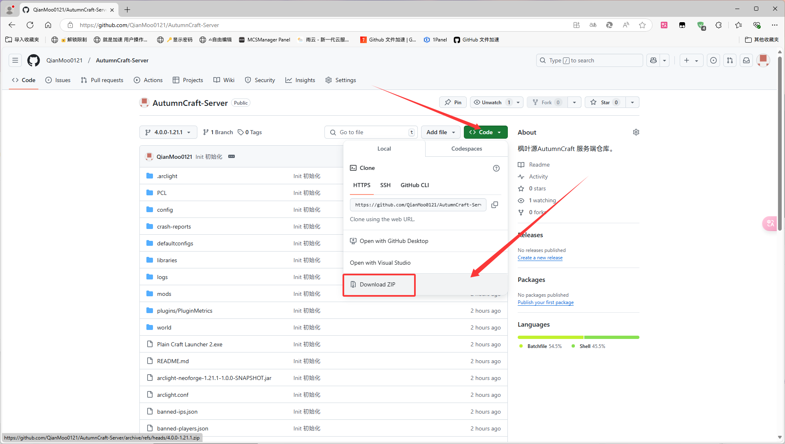
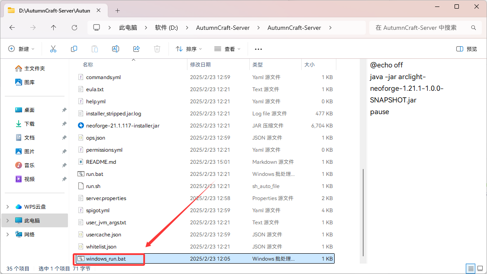

# 枫叶源AutumnCraft 第四代/BMC5 4.0.0

枫叶源是一个 **Arclight 1.21.1 (Neoforge + Paper)** 服务器，客户端基于 玩家所热爱，玩家所期盼 制作，主要内容是 冒险、魔法、工业，内包含了许多有趣的模组，支持AutumnCraft Skin登录。

**本服务端基于第四代3.0.0服务端重制！**

## 使用方法

注意！此服务端为测试版本，极不稳定，功能不完善。只适合想用来尝鲜的玩家们！

点击如图所示位置，会弹出下载框，下载即可。

下载完成后解压

Windows系统：双击`windows_run.bat`运行服务端，随后服务端将会开放到25565端口
Linux系统：执行`bash linux_run.sh`运行服务端，随后服务端将会开放到25565端口

启动客户端 >> 多人游戏 >> 添加服务器 >> IP填入127.0.0.1或localhost >> 完成，加入服务器.

## ToDo

- [x] 成功启动服务端
- [ ] 将3.0.0模组全部迁移完成
- [ ] 支持AutumnCraft Skin登录方式
- [ ] 实现基础玩家辅助功能（完成插件部分）
- [ ] 完成优化部分
- [ ] 使服务端达到生产环境标准（稳定，流畅，玩家正常游玩。）
- [ ] 完成定制化部分

## 3.0.0模组未支持列表

| Mod/版本           | 原因                                      | 备注         |
| ------------------ | ----------------------------------------- | ------------ |
| 植物魔法 -         | 未适配1.21.1（作者积极适配中）            |              |
| 机械动力及附属 -   | 未适配1.21.1（0.6将会适配，但是杳无音讯） |              |
| 匠魂3及附属 -      | 未适配1.21.1（杳无音讯）                  |              |
| 夸克 -             | 未适配1.21.1（杳无音讯）                  |              |
| 更好的下界 21.0.11 | 未知原因，无法启动服务端                  | 将在未来修复 |
| 天境Redux -        | 未适配1.21.1（杳无音讯）                  |              |
| 建筑手杖 -         | 未知原因，无法启动服务端                  | 将在未来修复 |

## 上线时间

尽情期待！将在3.0.0周目80%玩家毕业后全新上线！（预计暑假）

玩家交流群：807070559

